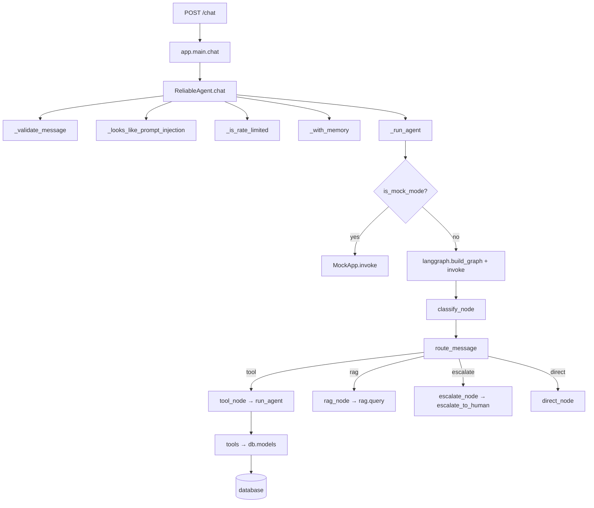

# Architecture Guide & Function Map

A guided tour of the codebase: **which function calls which**, and which functions
are real logic vs. glue vs. boilerplate.

---

## Legend — three kinds of code

| Tag | Meaning | Examples |
|---|---|---|
| 🧠 **CORE LOGIC** | Actual decisions & behavior — this is where the *value* is. Learn these first. | `chat()`, `route_message()`, `order_lookup()`, `query()` |
| 🔗 **GLUE** | Code that *connects* things but doesn't decide anything itself. | `TOOL_FUNCTIONS`, `tools`, `build_graph()` |
| ⚙️ **BOILERPLATE** | Standard setup/schema/CLI every project needs. Skim, don't memorize. | `Settings`, `ChatRequest`, `lifespan()`, `main()` |

> Rule of thumb: if you delete it and the app still "works" but can't start or talk
> to anything, it's boilerplate/glue. If deleting it changes *what the app does*,
> it's core logic.

---

## 1. The big picture — runtime call graph

What actually executes when a customer sends one message through the API:



**Read this as:** the request goes *down* the chain, and the answer comes back *up*.

---

## 2. The main path, step by step

1. **`app/main.py::chat`** 🧠 — receives the HTTP request. Runs the agent in a worker
   thread (so the server never freezes) and returns the reply.

2. **`ReliableAgent.chat`** 🧠 — the "survival layer". In order:
   - `_validate_message` — reject empty / oversized input.
   - `_looks_like_prompt_injection` — refuse obvious jailbreaks.
   - `_is_rate_limited` — slow down abusive callers.
   - `_with_memory` — prepend recent conversation context.
   - `_run_agent` → retries, then `_remember` + `_log`, or a fallback on total failure.

3. **`_run_agent`** 🔗 — the only place that *chooses* real vs. mock:
   - `MOCK_MODE=true` → `MockApp` (no LLM).
   - otherwise → `langgraph_agent.build_graph()`.

4. **LangGraph nodes** 🧠 — each does ONE job and writes its result into shared state:
   - `classify_node` → intent / urgency / sentiment / confidence.
   - `route_message` → decides the next node (reads state, never writes).
   - `tool_node` / `rag_node` / `escalate_node` / `direct_node` → produce `final_response`.

5. **`tool_calling_agent.run_agent`** 🧠 — if a tool is needed:
   - Ask the LLM which tool + arguments.
   - Execute the matching function from `TOOL_FUNCTIONS`.
   - Feed the result back to the LLM to write a friendly answer.

6. **Tool functions** 🧠 — the actual database work (`order_lookup`, `process_refund`, …).

---

## 3. File-by-file function map

### 3.1 `app/main.py` — the front door

| Function | Kind | What it does |
|---|---|---|
| `lifespan()` | ⚙️ | FastAPI startup/shutdown hook; creates the shared agent. |
| `health()` | 🧠 | `GET /health` — reports status + mock mode. |
| `chat()` | 🧠 | `POST /chat` — runs the agent in a thread, returns the reply. |

### 3.2 `agents/reliable_agent.py` — the survival layer

| Function | Kind | What it does |
|---|---|---|
| `ReliableAgent.chat()` | 🧠 | **Main entry point.** Orchestrates all checks below. |
| `_validate_message()` | 🧠 | Rejects empty / >5000-char messages. |
| `_looks_like_prompt_injection()` | 🧠 | Keyword-based refusal of jailbreaks. |
| `_is_rate_limited()` | 🧠 | Per-user sliding-window rate limit. |
| `_with_memory()` | 🧠 | Prepends recent turns to the message. |
| `_run_agent()` | 🔗 | Builds the graph (or `MockApp`) and invokes it. |
| `_remember()` | 🧠 | Stores the turn in memory. |
| `_log()` | 🧠 | Writes one JSONL log line. |
| `RunnableAgent` | ⚙️ | Protocol (type contract) for anything with `.invoke()`. |
| `Turn` | ⚙️ | Data holder for one conversation turn. |
| `FakeApp` | ⚙️ | Offline fake app used only in the eval. |

### 3.3 `agents/langgraph_agent.py` — the brain

| Function | Kind | What it does |
|---|---|---|
| `AgentState` | ⚙️ | TypedDict describing what the agent knows. |
| `classify_node()` | 🧠 | Classifies the message (calls Skill 1). |
| `tool_node()` | 🧠 | Routes to the tool-calling loop. |
| `rag_node()` | 🧠 | Routes to the RAG pipeline. |
| `escalate_node()` | 🧠 | Calls `escalate_to_human` directly. |
| `direct_node()` | 🧠 | Simple LLM reply, no tools/RAG. |
| `route_message()` | 🧠 | **The router** — reads state, returns the next node name. |
| `build_graph()` | 🔗 | Wires nodes + edges into a compiled graph. |
| `run()` | 🧠 | Runs one turn given a message. |
| `_infer_route()` | 🔗 | Helper for eval (guesses route from state). |
| `run_interactive()` / `run_eval()` | ⚙️ | CLI entry points. |

### 3.4 `agents/tool_calling_agent.py` — the tools (changed most in Phase 2)

| Function | Kind | What it does |
|---|---|---|
| `order_lookup()` | 🧠 | **Read** an order from the DB. |
| `process_refund()` | 🧠 | **Create** a refund row (status `pending`). |
| `get_customer_details()` | 🧠 | **Read** a customer from the DB. |
| `create_support_ticket()` | 🧠 | **Create** a ticket row. |
| `cancel_order()` | 🧠 | **Update** an order's status to `cancelled`. |
| `escalate_to_human()` | 🧠 | Returns an escalation confirmation. |
| `*_declaration` (×6) | 🔗 | JSON schema telling the LLM each tool exists. |
| `tools` | 🔗 | Bundle of all declarations sent to Gemini. |
| `TOOL_FUNCTIONS` | 🔗 | **The bridge:** tool name → Python function. |
| `SYSTEM_PROMPT` | 🧠 | Instructions controlling tool selection. |
| `create_agent()` | ⚙️ | Creates the Gemini client. |
| `generate_content_with_retry()` | 🧠 | Retry wrapper for rate limits. |
| `run_agent()` | 🧠 | **The tool loop:** pick tool → execute → respond. |

### 3.5 `agents/ticket_classifier.py` — Skill 1

| Function | Kind | What it does |
|---|---|---|
| `Intent` / `Urgency` / `Sentiment` | ⚙️ | Enums defining allowed values. |
| `TicketClassification` | ⚙️ | Pydantic output shape. |
| `SYSTEM_PROMPT` | 🧠 | The classification prompt. |
| `create_classifier()` | ⚙️ | Creates the Gemini client. |
| `classify_ticket()` | 🧠 | Calls Gemini (or mock) → returns `TicketClassification`. |

### 3.6 `agents/mock.py` — offline mode

| Function | Kind | What it does |
|---|---|---|
| `is_mock_mode()` | 🧠 | Reads `MOCK_MODE` (loads `.env` first). |
| `_find_order_id()` | 🔗 | Extracts an order id from text (regex). |
| `mock_classify_ticket()` | 🧠 | Keyword-rules classifier (no LLM). |
| `mock_run_agent()` | 🧠 | Keyword-rules tool selection (no LLM). |
| `mock_rag_query()` | 🧠 | Canned RAG answer (no LLM/DB). |
| `MockApp.invoke()` | 🧠 | Fake graph mirroring the real routing. |

### 3.7 `rag/rag_pipeline.py` — knowledge retrieval

| Function | Kind | What it does |
|---|---|---|
| `query()` | 🧠 | **Main entry:** embed → retrieve → generate (or mock). |
| `retrieve_chunks()` | 🧠 | Vector similarity search with threshold. |
| `generate_answer()` | 🧠 | LLM answer from injected context. |
| `build_rag_prompt()` | 🧠 | Builds the context-injection prompt. |
| `embed_query()` / `embed_documents()` | 🧠 | Text → vector (different task types). |
| `chunk_text()` | 🧠 | Paragraph-aware chunker. |
| `clean_text()` | 🧠 | Removes page numbers / normalizes whitespace. |
| `index_documents()` | 🧠 | Full indexing pipeline. |
| `get_connection()` / `setup_table()` | 🔗 | DB connection + table setup. |
| `RAGResponse` | ⚙️ | Pydantic response shape. |
| `main()` | ⚙️ | CLI entry point. |

### 3.8 `db/` — the database layer (NEW in Phase 2)

| Function | Kind | What it does |
|---|---|---|
| `engine` / `SessionLocal` / `Base` | ⚙️ | Connection + session factory (in `base.py`). |
| `init_db()` | 🔗 | Creates tables if missing. |
| `Customer` / `Order` / `Refund` / `Ticket` / `Conversation` | 🧠 | The data models (define the domain). |
| `_now()` | 🔗 | UTC timestamp helper. |
| `seed_data()` | 🧠 | Inserts sample data (idempotent). |

---

## 4. What changed in Phase 2 (the diff in plain words)

| Before | After |
|---|---|
| `order_lookup` read a hardcoded dict | Reads the `orders` table |
| `process_refund` returned a fake `$49.99` "approved" | Inserts a real `refunds` row with status `pending` and the order's real amount |
| 3 tools | 6 tools (+ `get_customer_details`, `create_support_ticket`, `cancel_order`) |
| No database layer | `db/` package: engine, models, seed |
| `escalate_to_human` | unchanged for now (real ticket creation comes later) |

**The one pattern that matters most** (appears in every tool function):

```python
init_db()                 # ensure tables exist
session = SessionLocal()  # open a conversation with the DB
try:
    ... work ...          # get / add / set
    session.commit()      # save (writes only)
finally:
    session.close()       # ALWAYS close
```

---

## 5. Quick reference — "I want to change X, so I edit Y"

| I want to… | Edit this file |
|---|---|
| Add a new tool | `agents/tool_calling_agent.py` (function + declaration + `TOOL_FUNCTIONS`) |
| Add a new table/column | `db/models.py` (+ rebuild DB or add a migration) |
| Change how the agent routes | `agents/langgraph_agent.py::route_message` |
| Change a prompt | `SYSTEM_PROMPT` in the relevant file |
| Change offline behavior | `agents/mock.py` |
| Change API endpoints | `app/main.py` + `app/schemas.py` |
| Change config | `app/config.py` + `.env` |
